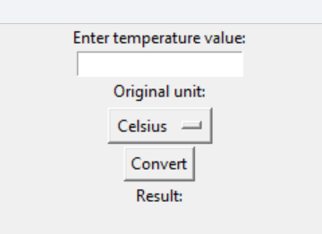
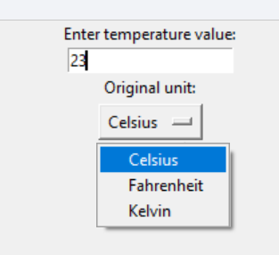
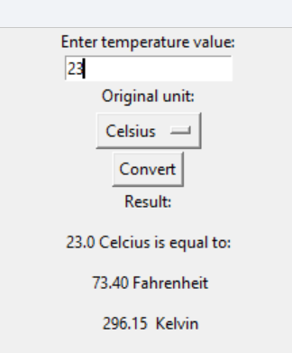

# Temperature Conversion Program

## Hello Users!!!

Welcome to the temperature conversion task given by Prodigy Infotech. This task is completed using Python programming language. Below are the images and a video demonstrating the deployed code.

### Table of Contents
- [Initial Page](#initial-page)
- [Entering Value](#entering-value)
- [Results](#results)
- [Video](#video)

### Initial Page

### Entering Value

### Results

### Video
<video width="300" height="300" controls>
  <source src="T_vid.mp4" type="video/mp4">Your browser does not support the video tag.</video>

